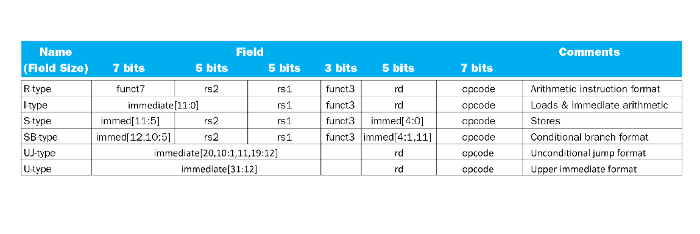

# Notes

## Tools

Prototyping
- Drawio
- Pencil & Paper / Tablet

Circuit Design
- Cadence Virtuoso

Collaboration
- GitHub
- Discord

## Timeline

Due Dates:
- January 30:	5min Presentation of description of design and implementation
- February 20:	HSPICE simulations verifying functionality (schematic)
- March 5:	Final report which should include Specification, design, testing strategies & results, areas for optimization, layout & schematics

## Tasks

- Prep:
	- [ ] Find or create schematics or HDL code for each component in the processor 
		- [x] Go to Kandasamy for help if needed
			- [x] Ask about Unknown parts
			- [x] Ask if the intermediate registers like TEMP and JUMP ADDR can be ignored in design diagram
		- Parts:
			- [x] PC Control
			- [x] RA, RB, RD, RJ, R_DEST are 3-bit registers
			- [x] DISP and CONST, RX and RY, D_DEST are 8-bit registers
			- [x] SC, RZ is 1-bit register
			- [x] RM
			- [ ] CLK
   			- [x] ALU
			- [x] Unknowns
				- [x] TEMP
				- [x] P_OUT (register? d flip flop?)
				- [x] PORT ADDR & PORT DATA
				- [x] DATA MEMORY (256 Bytes)

- Specification:
	- Use existing design
	- [ ] Summarize logic of Pico processor
	- [ ] Come up with ways to test and verify design
	- [ ] Estimate area
	- [ ] Estimate power 
	- [ ] Estimate performance

 ## Research

 Products using Pico processors:
- [Raspberry Pi Pico](https://www.raspberrypi.com/products/raspberry-pi-pico/)
- [Pico-8 Fantasy Console](https://www.lexaloffle.com/pico-8.php)
- [RP2040](https://en.wikipedia.org/wiki/RP2040)

Other:
- [Pico Processor in VHDL](https://www.researchgate.net/publication/259864953_Pico_Processor_Using_Verilog_HDL)
	- Pico processor is scaled down version of RISC processor
	- pipelined, 5 stages
- [8-bit Processing](https://en.wikipedia.org/wiki/8-bit_computing)

## Logs

### February 6, 2024

What we did
- Added standards to [README.md](/README.md) for making schematics and layouts so that our designs don't conflict
- Presented first design draft
- Decided on doing a pipelined 8-bit Pico Processor

What we need to do:
- [x] Adjust our cells to first height of OSU library's standard cells.
- [x] Create a floorplan to determine how everything is connected and be able to divide up the work.

### February 20, 2024

What we did:
- Divide up work:
    - Melissa G: 1, 3, 8 bit Registers
    - Mike W: ALU
    - Preeti C: Demuxes
    - Leo C: Register Bank
- Finished schematics for Registers and ALU
- Finally able to push changes from Xunil
    - Had to clone repo with SSH link rather than HTTP...

What ew need to do:
- [x] Complete testing for Registers and ALU
- [x] Create and test Demuxed
- [x] Create and test Register Bank
- [x] Figure out how the instructions for this processor will work

### March 12, 2024

Instructions for this 8-bit Pico Processor will follow the RISC-V instruction format found 

